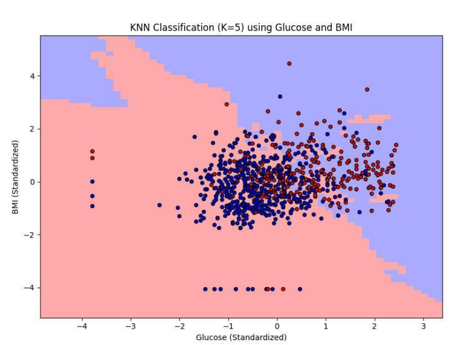
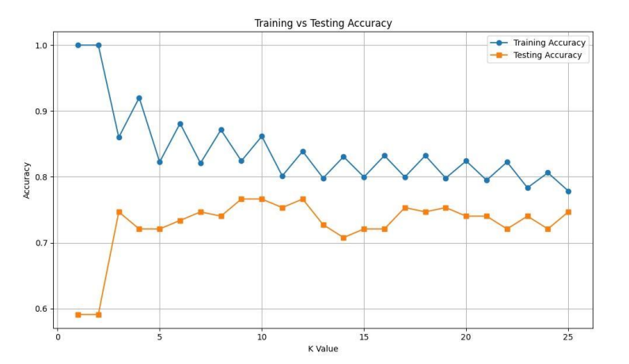
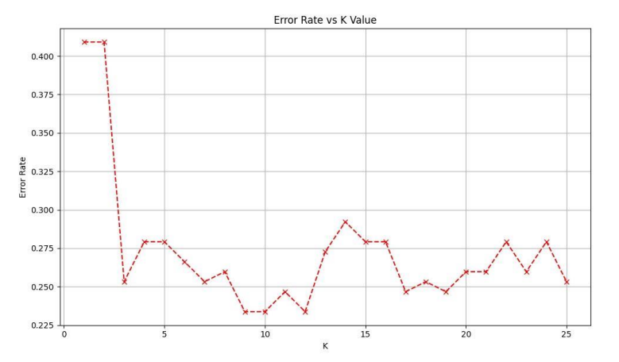
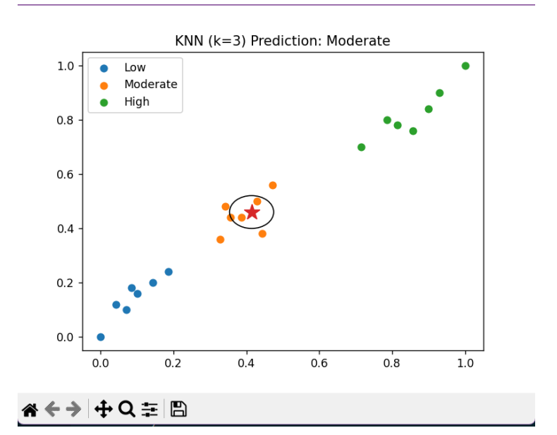
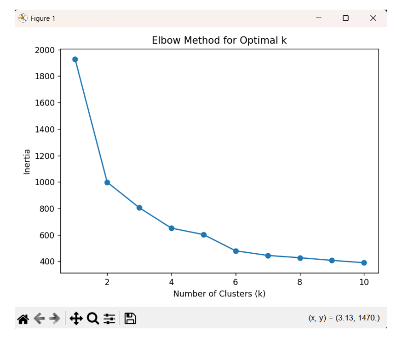
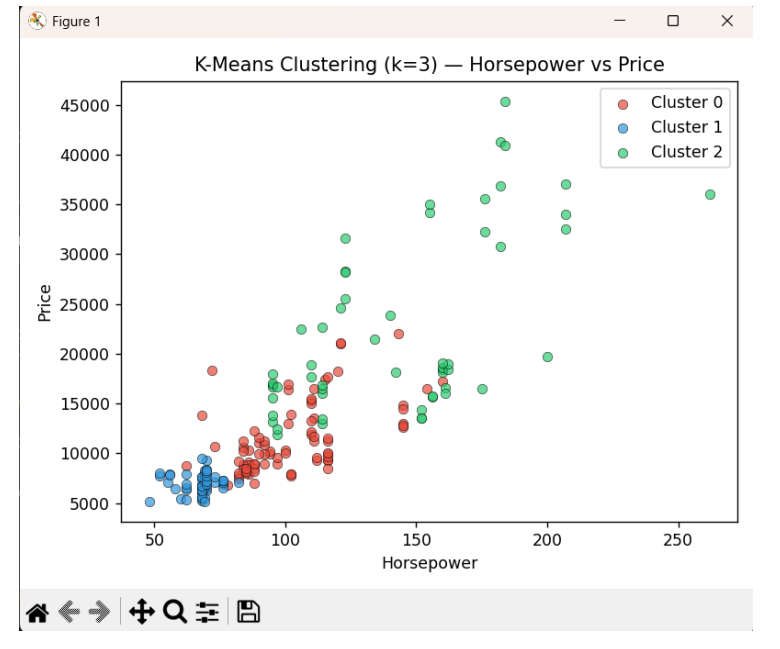
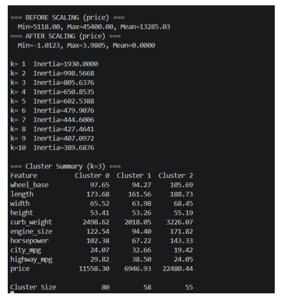

# Group-12---KNN_-K-MEANS-Activity-Computational_Science2026
# Machine Learning Activities
### Computational Science for Computer Science
**University of Southern Mindanao — College of Engineering and Information Technology**
*Department of Computing and Information Science*

---

## 📋 Table of Contents

- [Activity 1: KNN on Diabetes Dataset](#activity-1-knn-on-diabetes-dataset)
- [Activity 2: KNN on Custom Dataset (BP & Heart Rate)](#activity-2-knn-on-custom-dataset)
- [Activity 3: K-Means Clustering on Automobile Dataset](#activity-3-k-means-clustering-on-automobile-dataset)

---

## Activity 1: KNN on Diabetes Dataset

> **Topic:** Machine Learning – K-Nearest Neighbors
> **Dataset:** Pima Indians Diabetes Dataset (768 samples, 8 features)

### Part 1: Data Understanding

#### Feature Descriptions

| Feature | Description |
|---|---|
| `Pregnancies` | Total number of times the patient has been pregnant |
| `Glucose` | Blood plasma glucose concentration (2-hr post-meal) |
| `BloodPressure` | Diastolic blood pressure (mm Hg) |
| `SkinThickness` | Triceps skinfold thickness (body fat estimate) |
| `Insulin` | Serum insulin level in the blood |
| `BMI` | Body Mass Index (kg/m²) |
| `DiabetesPedigreeFunction` | Hereditary risk score based on family history |
| `Age` | Patient age in years |

#### Most Important Features
- **Glucose** — Primary clinical indicator of diabetes
- **BMI** — Leading cause of insulin resistance
- **Age** — Insulin sensitivity declines with age
- **DiabetesPedigreeFunction** — Strong genetic predisposition indicator

#### Missing / Problematic Values
Several features contained `0` values that are physiologically impossible, treated as missing data:
- `Glucose`, `BloodPressure`, `BMI` — zeros are impossible for a living person
- `SkinThickness`, `Insulin` — very high frequency of zeros (25th percentile = 0)

---

### Part 2: Data Preprocessing

#### Strategy
- **Missing Values:** Median Imputation (prevents zeros from skewing distance calculations)
- **Feature Scaling:** Z-score Standardization

$$z = \frac{x - \mu}{\sigma}$$

#### Before vs. After Preprocessing

**After Imputation, Before Scaling:**

| Feature | Mean | Std Dev | Min | Max |
|---|---|---|---|---|
| Pregnancies | 3.85 | 3.37 | 0.00 | 17.00 |
| Glucose | 121.66 | 30.44 | 44.00 | 199.00 |
| Insulin | 140.67 | 86.38 | 14.00 | 846.00 |
| BMI | 32.46 | 6.88 | 18.20 | 67.10 |
| Age | 33.24 | 11.76 | 21.00 | 81.00 |

**After Standardization:**

| Feature | Mean | Std Dev | Min | Max |
|---|---|---|---|---|
| Pregnancies | ~0.00 | 1.00 | -1.14 | 3.91 |
| Glucose | ~0.00 | 1.00 | -2.55 | 2.54 |
| Insulin | ~0.00 | 1.00 | -1.47 | 8.17 |
| BMI | ~0.00 | 1.00 | -2.07 | 5.04 |
| Age | ~0.00 | 1.00 | -1.04 | 4.06 |

---

### Part 3: KNN Implementation

- **Train/Test Split:** 80/20 → Training: 614 samples | Testing: 154 samples
- **K Values Tested:** K = 3, K = 5, K = 7
- **Distance Metric:** Euclidean Distance

$$d = \sqrt{\sum_{i=1}^{n}(x_i - y_i)^2}$$

#### Manual Computation — Test Instance (Index 679)

**Test Instance Features (Scaled):**

| Pregnancies | Glucose | BloodPressure | SkinThickness | Insulin | BMI | Pedigree | Age |
|---|---|---|---|---|---|---|---|
| -0.548 | -0.679 | -1.190 | -1.378 | 1.440 | -1.202 | 0.429 | -0.871 |

**Distance Rankings (Top 10 Training Samples):**

| Train Index | Euclidean Distance | Label |
|---|---|---|
| 629 | 2.390 | 0 (Non-diabetic) |
| 145 | 2.620 | 0 (Non-diabetic) |
| 243 | 3.001 | 1 (Diabetic) |
| 180 | 3.550 | 0 |
| 343 | 3.892 | 0 |
| 718 | 3.893 | 0 |
| 616 | 4.330 | 0 |
| 561 | 4.514 | 1 |
| 681 | 5.310 | 1 |
| 43 | 6.740 | 1 |

**Prediction for K=3:** Neighbors → Index 629 (0), 145 (0), 243 (1) → **Majority Vote: 0 (Non-diabetic)** 

#### Visualization

---

### Part 4: Model Evaluation

| K Value | Accuracy | TN | FP | FN | TP | Correct / Total |
|---|---|---|---|---|---|---|
| K = 3 | 74.68% | 86 | 16 | 23 | 29 | 115 / 154 |
| K = 5 | 72.08% | 82 | 20 | 23 | 29 | 111 / 154 |
| K = 7 | 74.68% | 83 | 19 | 20 | 32 | 115 / 154 |

> **Best K:** K = 3 and K = 7 tied at 74.68%. In a medical context, **K = 7 is preferable** because it produced fewer False Negatives (missing a diabetic patient is the costlier mistake).

#### Visualization

---

### Part 5: Analysis & Reflection

#### Strengths of KNN
- **Non-parametric** — makes no assumptions about data distribution
- **Zero training time** — stores data and computes distances on demand
- Effective for complex, non-linear relationships

#### Limitations of KNN
- **High computational cost** — must calculate distance to every training point at prediction time
- **Sensitive to feature scaling** — unscaled features with large ranges dominate distance calculations
- **Curse of dimensionality** — performance degrades with high-dimensional data

#### When KNN is Appropriate
-  Small to medium-sized, clean datasets
-  Low number of features
-  As a baseline model before trying complex algorithms
#### When KNN is  not Appropriate
-  Real-time prediction systems
-  High-dimensional data
-  Severely imbalanced class distributions

#### Visualization 

---
---

## Activity 2: KNN on Custom Dataset

> **Topic:** Machine Learning – K-Nearest Neighbors (Own Dataset)
> **Dataset:** 21 patients with Blood Pressure, Heart Rate, and Risk Level

### Part 1: Data Understanding

#### Features

| Feature | Description |
|---|---|
| `Blood Pressure (BP)` | Force of blood against artery walls (mmHg) |
| `Heart Rate (HR)` | Number of heartbeats per minute |
| `Risk Level` | Target variable: Low / Moderate / High |

- **Most important features:** BP and HR — both directly relate to patient cardiovascular condition
- **Missing values:** None detected
- **Potential issues:** Possible outliers at very high BP/HR values; feature scaling required

---

### Dataset

| Patient ID | Blood Pressure | Heart Rate | Risk Level |
|---|---|---|---|
| 1 | 130 | 82 | Moderate |
| 2 | 110 | 65 | Low |
| 3 | 165 | 98 | High |
| 4 | 118 | 72 | Low |
| 5 | 135 | 85 | Moderate |
| 6 | 155 | 95 | High |
| 7 | 112 | 68 | Low |
| 8 | 168 | 102 | High |
| 9 | 129 | 84 | Moderate |
| 10 | 108 | 66 | Low |
| 11 | 175 | 110 | High |
| 12 | 132 | 82 | Moderate |
| 13 | 111 | 69 | Low |
| 14 | 160 | 100 | High |
| 15 | 136 | 79 | Moderate |
| 16 | 115 | 70 | Low |
| 17 | 170 | 105 | High |
| 18 | 128 | 78 | Moderate |
| 19 | 105 | 60 | Low |
| 20 | 138 | 88 | Moderate |

---

### Part 2: Data Preprocessing

- **Missing values:** None — no imputation needed
- **Scaling method:** Min-Max Normalization

$$x' = \frac{x - \min}{\max - \min}$$

**Before and After Scaling (Sample):**

| ID | BP (raw) | HR (raw) | BP (scaled) | HR (scaled) |
|---|---|---|---|---|
| 2 | 110 | 65 | 0.11 | 0.10 |
| 5 | 135 | 85 | 0.44 | 0.50 |
| 11 | 175 | 110 | 1.00 | 1.00 |

---

### Part 3: KNN Implementation

- **Train/Test Split:** 80/20 → Training: 17 patients | Testing: 4 patients (IDs: 3, 8, 12, 20)
- **K Values Tested:** K = 3, K = 5, K = 7

#### Manual Computation — Test Instance ID 12 (BP=132, HR=82)

| Neighbor ID | BP | HR | Distance | Risk |
|---|---|---|---|---|
| 1 | 130 | 82 | 2.00 | Moderate |
| 9 | 129 | 84 | 3.61 | Moderate |
| 5 | 135 | 85 | 4.24 | Moderate |
| 18 | 128 | 78 | 5.66 | Moderate |
| 2 | 110 | 65 | 27.80 | Low |
| 7 | 112 | 68 | 24.41 | Low |
| 6 | 155 | 95 | 26.40 | High |
| 10 | 108 | 66 | 29.73 | Low |
| 14 | 160 | 100 | 33.94 | High |
| 3 | 165 | 98 | 36.40 | High |

**Prediction for K=3:** Neighbors → ID 1 (Moderate), 9 (Moderate), 5 (Moderate) → **Predicted: Moderate** 

---

### Part 4: Model Evaluation

| K | Accuracy |
|---|---|
| 3 | 100% |
| 5 | 100% |
| 7 | 75% |

**Confusion Matrix (K=3 / K=5):**

| Actual \ Predicted | Low | Moderate | High |
|---|---|---|---|
| Low | 1 | 0 | 0 |
| Moderate | 0 | 2 | 0 |
| High | 0 | 0 | 1 |

> **Best K:** K = 3 or K = 5 (both achieved 100% accuracy on the test set).

---

### Part 5: Analysis & Reflection

KNN performed well on this small, clean cardiovascular dataset. Key observations:

- **Strengths:** Simple to understand, no training phase, flexible and adaptive
- **Limitations:** Computationally expensive on large datasets; sensitive to feature scaling and noise
- **Best use case:** Small-to-medium datasets with clear feature-class relationships
- **Experiment takeaway:** K=3 gave the most accurate predictions; larger K values introduced incorrect neighbors, reducing accuracy — demonstrating the bias-variance tradeoff in practice

#### Visualization

---
---

## Activity 3: K-Means Clustering on Automobile Dataset

> **Topic:** Machine Learning – K-Means Clustering (Unsupervised)
> **Dataset:** Automobile dataset with price, horsepower, engine size, and fuel efficiency

### Part 1: Data Understanding

#### Numerical Features Used for Clustering

| Feature | Role in Clustering |
|---|---|
| `Price` | Separates economy vs. luxury vehicles |
| `Horsepower` | Distinguishes low vs. high-performance cars |
| `Engine Size` | Reinforces performance groupings |
| `City MPG` | Identifies fuel-efficient vs. performance cars |
| `Highway MPG` | Complements city MPG for efficiency profiling |
| `Curb Weight` | Physical size indicator |
| `Wheel Base`, `Length`, `Width`, `Height` | Physical dimensions |

#### Categorical Features (Post-Clustering Analysis Only)
`Make`, `Body Style`, `Fuel Type`, `Drive Wheels` — retained to interpret and describe clusters after the algorithm runs.

---

### Part 2: Data Preprocessing

- **Missing values:** Rows with non-convertible feature values were removed
- **Categorical features:** Excluded from clustering (K-Means requires numerical input)
- **Scaling:** Z-score Standardization applied to all numerical features

$$z = \frac{x - \mu}{\sigma}$$

**Example — Price Before and After Scaling:**

| | Min | Max | Mean |
|---|---|---|---|
| Before | 5,118.00 | 45,400.00 | 13,285.03 |
| After | -1.0123 | 3.9805 | 0.0000 |

---

### Part 3: K-Means Implementation

#### Elbow Method — Inertia by K

| K | Inertia |
|---|---|
| 1 | 1930.00 |
| 2 | 998.57 |
| 3 | 805.64 |
| 4 | 650.85 |
| 5 | 602.54 |
| 6 | 479.91 |
| 7 | 444.60 |
| 8 | 427.46 |
| 9 | 407.10 |
| 10 | 389.69 |

> The curve shows a noticeable bend at **K = 3**, making it the selected optimal value.

#### Visualization:

#### Manual Computation (K=2, 5 Data Points, 2 Features)

**Scaled Data Points:**

| Point | Horsepower (x) | Price (y) |
|---|---|---|
| A | -0.8 | -0.9 |
| B | -0.6 | -0.7 |
| C | 0.2 | 0.3 |
| D | 0.5 | 0.6 |
| E | 1.0 | 1.2 |

**Initial Centroids:** C1 = (-0.7, -0.8) | C2 = (0.6, 0.7)

**Cluster Assignments:**
- Cluster 1 → A, B (low price, low horsepower)
- Cluster 2 → C, D, E (higher price, higher horsepower)

**Updated Centroids:**
- C1' = (-0.70, -0.80)
- C2' = (0.57, 0.70)

---

### Part 4: Model Evaluation

**Optimal K = 3**

#### Cluster Summary (K=3)

| Feature | Cluster 0 | Cluster 1 | Cluster 2 |
|---|---|---|---|
| Wheel Base | 97.65 | 94.27 | 105.69 |
| Engine Size | 122.54 | 94.40 | 171.82 |
| Horsepower | 102.38 | 67.22 | 143.33 |
| City MPG | 24.07 | 32.66 | 19.42 |
| Highway MPG | 29.82 | 38.50 | 24.05 |
| Price | $11,558 | $6,947 | $22,480 |
| **Cluster Size** | **80** | **58** | **55** |

#### Cluster Interpretation

| Cluster | Segment | Profile |
|---|---|---|
| **Cluster 0** | Mid-Range Cars | Moderate price, moderate performance, balanced efficiency |
| **Cluster 1** | Economy Cars | Low price, low horsepower, high fuel efficiency |
| **Cluster 2** | Luxury / High-Performance | High price, high horsepower, large engine, lower MPG |

> As K increases, WCSS always decreases — but diminishing returns begin after K=3, confirming it as the elbow point.

#### Visualization:

---

---

### Part 5: Analysis & Reflection

#### Strengths of K-Means
- Computationally efficient and easy to implement
- Produced interpretable, meaningful vehicle segments
- Works well for market segmentation and exploratory analysis

#### Limitations of K-Means
- Cannot natively handle categorical features (make, body style, fuel type)
- Sensitive to feature scaling — large-scale features like price dominate without normalization
- Assumes spherical, evenly-sized clusters — some overlap observed in 2D visualization
- Requires predetermining K, which demands careful interpretation

#### When K-Means is Appropriate
-  Purely numerical data with clear natural groupings
-  Exploratory / unsupervised analysis goals
#### When K-Means is not Appropriate
-  Datasets with many categorical variables
-  Irregularly shaped or highly overlapping clusters

#### Key Observation
Proper feature selection and standardization significantly improved clustering quality. The Elbow Method provided a principled way to choose K=3, yielding well-separated and interpretable vehicle segments despite some visual overlap in 2D projections.

